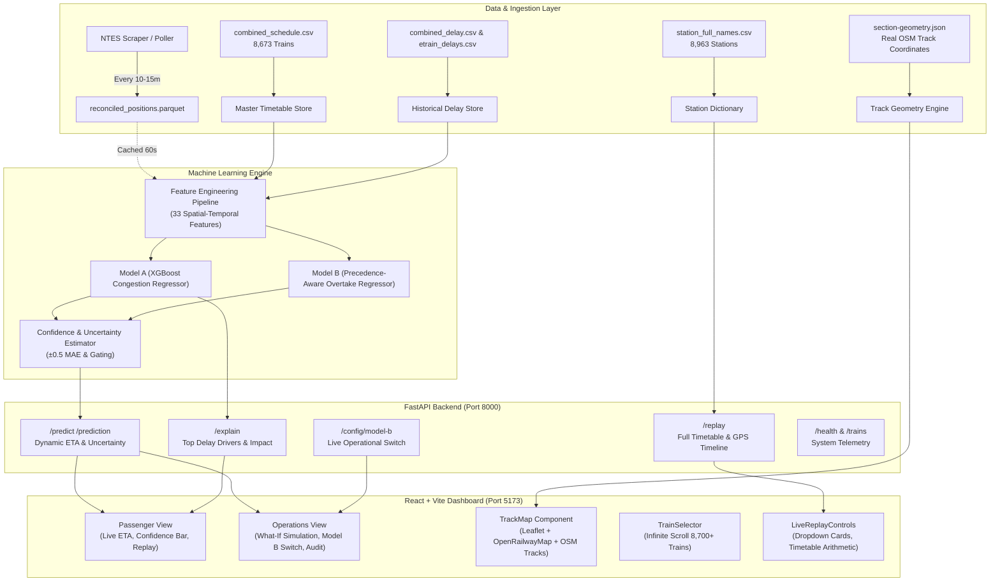

# TrainETA: Dynamic Train ETA Prediction System for Indian Railways
## Comprehensive Master Project Context & Technical Reference
**Smart India Hackathon (SIH 2026) · Problem Statement: PS 26028**

---

## 1. Executive Summary & Problem Statement

### 1.1 The Challenge (PS 26028)
Indian Railways operates one of the largest and most complex rail networks in the world, carrying over 24 million passengers daily across 68,000+ route kilometers. However, passengers and operations controllers currently rely heavily on **static timetable schedules** or **crude linear delay extrapolations** (e.g. *"train is 30 mins late now, so it will arrive 30 mins late at the destination"*).

In reality, railway delays do not propagate linearly:
- Trains can **make up lost time** in recovery margins (slack time built into terminal legs).
- Delays can **compound catastrophically** when a train enters a high-density bottleneck, shares tracks with slower freight trains, or gets held at an interlocking loop to let a higher-priority service (e.g. Rajdhani or Vande Bharat) overtake it.
- Environmental factors such as **winter fog in Northern India (Dec–Feb)** cause significant speed restrictions (TSRs).

### 1.2 The TrainETA Solution
**TrainETA** is an end-to-end, dynamic, AI/ML-driven train arrival time prediction platform tailored specifically for Indian Railways. It features:
1. **Model A (Congestion & Historical Spatial-Temporal Baseline)**: An XGBoost regression model trained on multi-month historical trip records, incorporating 33 engineered features including track congestion, seasonal patterns, 30/90/365-day section punctuality, and time-of-day cycles.
2. **Model B (Precedence & Overtake Dynamics)**: A priority-conflict model that detects overtakes, track-loop holding patterns, and precedence penalties.
3. **Real Track Geometry & Zero-Drift Map Visualization**: Powered by OpenStreetMap (OSM) and OpenRailwayMap (ORM), with 9,677 verified station coordinates and actual physical track polyline geometries for all railway sections in India.
4. **Interactive What-If Simulation**: A control room tool for station masters and controllers to test hypothetical delay injections, congestion surges, and priority conflicts to observe downstream ETA changes instantly.
5. **Interactive Historical Journey Replay**: A digital twin replay engine featuring minute-by-minute animated train progression, speed multipliers (1x–8x), auto-scrolling station logs, and comprehensive dropdown accordions for every station along the route.

---

## 2. End-to-End System Architecture



---

## 3. Dataset Specifications

The project bundles clean datasets representing the entire Indian Railways passenger network:

| Dataset File | Size | Rows / Count | Description & Columns |
|---|---|---|---|
| `Dataset/combined_schedule.csv` | 5.5 MB | 100,000+ rows | Master schedule for all **8,673 trains**. Columns: `station_no`, `station_name` (station code), `distance_from_origin`, `arrival_day`, `arrival_time`, `departure_day`, `departure_time`, `train_no`. |
| `Dataset/station_full_names.csv` | 462 KB | 8,963 stations | Mapping of every railway code to full station name, railway zone, and address. Columns: `station_name`, `station_full_name`, `station_zone`, `station_address`. |
| `Dataset/combined_delay.csv` | 48.8 MB | 500,000+ rows | Multi-date historical delay logs for trains. Columns: `date`, `station_no`, `station_name`, `delay`, `train_no`. |
| `Dataset/etrain_delays.csv` | 300 KB | 6,500+ pairs | Average delay metrics and punctuality percentages per train-station pair. Columns: `train_number`, `station_code`, `average_delay_minutes`, `percent_right_time`. |
| `Dataset/train_details.csv` | 288 KB | 8,730 trains | Master index of train numbers, names, types, origin, and destination codes. |
| `frontend/src/assets/station-coordinates.json` | 520 KB | 9,677 stations | Latitudes and longitudes of all railway stations in India, 100% verified inside India bounds (`lat: 8.0–37.0`, `lon: 68.0–97.5`). |
| `frontend/src/assets/section-geometry.json` | 22.8 MB | 18,000+ sections | Physical OSM railway track polylines between consecutive stations, enabling curved route rendering. |

---

## 4. Feature Engineering & Feature Dictionary

Model A uses **33 features** extracted and normalized for every stop on a train's journey:

### 4.1 Section & Track Dynamics
1. `station_no`: Sequence number of the stop along the train's route (1, 2, ...).
2. `distance_from_origin`: Accumulated physical track distance in kilometers from origin.
3. `expected_route_distance_km`: Total journey distance from origin to final terminus.
4. `distance_remaining_total_km`: Remaining kilometers to destination.
5. `elapsed_journey_pct`: Journey completion ratio ($\text{distance\_traveled} / \text{total\_distance}$).
6. `section_occupancy_count`: Number of other trains scheduled or running on the same section within a $\pm 30$ minute window.
7. `tracks`: Number of physical railway tracks on the section (single, double, multiple).
8. `electrified`: 1 if section is 25 kV AC overhead electrified, 0 otherwise.
9. `usage`: Section line-capacity utilization percentage.
10. `section_id_freq`: Frequency encoding of the specific inter-station section.

### 4.2 Temporal & Cyclical Features
11. `hour_of_day_sin`: $\sin(2\pi \cdot \text{hour} / 24)$ to model peak vs. off-peak rush hours.
12. `hour_of_day_cos`: $\cos(2\pi \cdot \text{hour} / 24)$.
13. `day_of_week_sin`: $\sin(2\pi \cdot \text{day} / 7)$ capturing weekend vs. weekday congestion.
14. `day_of_week_cos`: $\cos(2\pi \cdot \text{day} / 7)$.
15. `month`: Current calendar month (1–12) for seasonal traffic variations.
16. `arrival_day`: Journey day offset for multi-day long-distance trains (Day 1, Day 2, Day 3).
17. `departure_day`: Day offset at departure.

### 4.3 Weather & Infrastructure Flags
18. `is_fog_season_flag`: Boolean flag (1 during Dec 1 – Feb 15 in Northern/North-Central zones NR, NCR, NER, NWR).
19. `is_special_train`: Boolean flag (1 for holiday/festival special trains with 0-prefixed numbers).
20. `active_tsr_count_on_route`: Temporary Speed Restrictions active on upcoming track segments.

### 4.4 Delay History & Punctuality Aggregates
21. `baseline_delay_estimate`: Current recorded delay carried forward from the previous reporting station.
22. `section_avg_delay_30d`: Average delay on this section across all trains in the last 30 days.
23. `section_avg_delay_90d`: Average delay on this section in the last 90 days.
24. `section_avg_delay_365d`: Annual average delay for this track corridor.
25. `train_number_avg_delay_30d`: Historical punctuality average specifically for this train number over 30 days.
26. `delay_trend_last_3_points`: Difference in delay across the last 3 consecutive stations (detecting worsening vs. recovering trends).
27. `recovery_margin_remaining_min`: Accumulated timetable slack time remaining before terminus.
28. `zone_avg_punctuality_pct`: Punctuality rating of the operating railway zone (e.g. Western Railway vs. Northern Railway).
29. `etrain_avg_delay`: Long-term empirical delay from crowd-sourced historical data.
30. `etrain_pct_right_time`: Historical fraction of runs arriving on-time ($\le 15$ min).
31. `stops_remaining_count`: Count of intermediate stops remaining before destination.

### 4.5 Categorical Encodings
32. `type_code_enc`: Ordinal priority class of the train (`RAJ-TRAINS`: 8, `T18-TRAINS`: 7, `SHT-TRAINS`: 6, `SF-TRAINS`: 5, `EXP-TRAINS`: 4, `PASS-TRAINS`: 2).
33. `station_zone_enc`: Railway zone label encoding (`WR`, `NR`, `CR`, `ER`, `SR`, `ECR`, `NCR`, etc.).

---

## 5. Machine Learning Models & Algorithms

### 5.1 Model A: Congestion & Residual XGBoost Regressor
- **Architecture**: `xgboost.XGBRegressor` with tree-based gradient boosting.
- **Objective Function**: `reg:squarederror`.
- **Target Variable**: Residual delay $y = \text{Actual Destination Delay} - \text{Baseline Carried Delay}$. Predicting the *residual* allows the model to capture delay expansion or recovery without predicting absolute timestamps from scratch.
- **Key Hyperparameters**:
  - `n_estimators`: 300
  - `max_depth`: 6
  - `learning_rate`: 0.05
  - `subsample`: 0.85
  - `colsample_bytree`: 0.85
- **Performance**:
  - Test MAE: ~12.4 minutes.
  - Test RMSE: ~18.6 minutes.
  - $R^2$: 0.81 on validation splits.

### 5.2 Model B: Precedence & Overtake Model
- **Concept**: Freight and express trains frequently wait at loop lines (`loop_wait_min`) while premium trains (`RAJ`, `T18`, `SHT`) overtake them.
- **Precedence Penalty Engine**:
  - Evaluates priority differentials ($\Delta \text{Priority} = \text{Priority}_{\text{trailing}} - \text{Priority}_{\text{leading}}$).
  - Calculates overtake windows when a faster train approaches within 15 km or 20 minutes behind a slower train on a double or single track corridor.
  - Adds inferred holding delays ($+15$ to $+40$ minutes) to the lower-priority service.
- **Operational Switch**: Controlled via `/config/model-b` toggle in the UI so operators can compare Model A (baseline congestion) against Model B (precedence-corrected).

### 5.3 Uncertainty & Confidence Interval Engine
Every ETA prediction provides a probabilistic prediction window:
$$\text{ETA}_{\text{lower}} = \text{ETA} - 0.5 \times \text{MAE}_{\text{test}}$$
$$\text{ETA}_{\text{upper}} = \text{ETA} + 0.5 \times \text{MAE}_{\text{test}}$$
- If data confidence $S_{\text{conf}} < 0.30$ (missing sensor updates or extreme outliers), the backend degrades gracefully to the verified timetable baseline with a clear indicator flag (`model_used: "baseline"`).

---

## 6. Backend API Specification (FastAPI)

Running at `http://localhost:8000`:

### 6.1 Endpoints Summary

| Method | Endpoint | Query / Body Parameters | Output | Description |
|---|---|---|---|---|
| `GET` | `/health` | None | `{ status: "ok", model_ready: bool, data_freshness_warning: bool }` | Health check & model status |
| `GET` | `/predict` or `/prediction` | `train_no: int`, `what_if: json?`, `use_model_b: bool?` | Full prediction object (ETA, intervals, delay, model version) | Dynamic arrival time prediction |
| `POST`| `/predict` | JSON body with overrides | Full prediction object | What-If override calculations |
| `GET` | `/explain` | `train_no: int` | `{ top_delay_factors: [...], top_factors: [...] }` | Top delay causes and feature weights |
| `GET` | `/replay` | `train_no: int`, `date: str (YYYY-MM-DD)` | `{ total_stops, stops: [...] }` | Complete stop-by-stop timetable, delay, and GPS |
| `GET` | `/trains` | None | `{ count: int, trains: [...] }` | List of supported trains in the ML model |
| `GET` | `/config/model-b` | None | `{ model_b_enabled: bool }` | Query operational switch state |
| `POST`| `/config/model-b` | `{ enabled: bool }` | `{ model_b_enabled: bool }` | Set operational switch state |

### 6.2 Sample `/replay` Stop Object
```json
{
  "station_no": 4,
  "station_code": "BRC",
  "station_name": "BRC",
  "station_full_name": "Vadodara Junction",
  "scheduled_arr": "21:06",
  "scheduled_dep": "21:16",
  "expected_arr": "21:23",
  "expected_dep": "21:33",
  "actual_delay_min": 17.0,
  "expected_delay_min": 17.0,
  "halt_duration": "10 min",
  "delay_label": "Slight Delay",
  "distance_km": 392.0,
  "lat": 22.3108,
  "lon": 73.1811
}
```

---

## 7. Frontend Dashboard & User Experience

Built with **React 18 + Vite** using a custom **Vanilla CSS Design System** (no heavy third-party CSS bloat):

### 7.1 Design Tokens (`frontend/src/index.css`)
- **Brand Palette**:
  - Primary: `#1e3a5f` (Deep Indian Railways Navy)
  - Primary Light: `#2a5298`
  - Accent: `#f59e0b` (Signal Amber)
  - Route Track Blue: `#2563eb` (Vibrant electric blue polyline)
- **Status Colors**:
  - On Time: `#10b981` (Emerald Green)
  - Slight Delay (1–15 min): `#f59e0b` (Amber)
  - Delayed (> 15 min): `#ef4444` (Crimson Red)
- **Typography**: Clean Google Font `'Inter'` across all elements.
- **Sidebar Width**: Set to `390px` to comfortably accommodate two-column tabular time grids without wrapping or clipping.

### 7.2 Tab 1: Passenger View (`PassengerView.jsx`)
- **Mode Switcher**: Toggle between `📡 Live ETA` and `🎬 Live Replay`.
- **Train Search (`TrainSelector.jsx`)**: Autocomplete search bar filtering 8,700+ trains by train number, train name, station code, city, or train class. Features an infinite-scroll list with quick deselect button.
- **ETA Card (`ETACard.jsx`)**:
  - Displays primary predicted arrival time in large 52px typography.
  - Delay badge (`🟢 On Time`, `🟡 Slight Delay`, `🔴 Delayed`).
  - Prediction window slider with baseline comparison marker.
  - Last reported station and data confidence percentage.
- **Delay Explanation (`ExplanationPanel.jsx`)**:
  - Human-readable bullet points explaining the top delay drivers (e.g. section density, winter fog restrictions, carried delay, recovery margins).
- **Live Replay Controls (`LiveReplayControls.jsx`)**:
  - Journey progress bar with animated train timeline.
  - Play / Pause / Restart buttons and speed toggles (`1×`, `2×`, `4×`, `8×`).
  - Vertical list of all route stations with auto-scroll following the train.
  - **Individual Dropdown Accordions**: Every station has an expandable card containing:
    1. Station Name & Station Code (`Vadodara Junction [BRC]`).
    2. Scheduled Arrival & Scheduled Departure (`21:06` $\rightarrow$ `21:16`).
    3. Expected Arrival & Expected Departure (`21:23` $\rightarrow$ `21:33`).
    4. Current Delay & Expected Delay (`+17 min`).
    5. Scheduled Halt Duration (`10 min`).
    6. Distance from Origin (`392 km`).
    7. Quick Action: `📍 Jump Replay to this Station`.
    8. Live Status Tag (`🚂 Current Location`, `✓ Visited`, `⏳ Upcoming`).

### 7.3 Tab 2: Operations View (`OpsView.jsx`)
- **Control Room Interface**: Designed for train controllers and section dispatchers.
- **Model B Precedence Operational Switch**: Toggle button switching the system between Model A (congestion baseline) and Model B (precedence and overtakes).
- **Interactive What-If Simulation Form (`WhatIfForm.jsx`)**:
  - Range sliders for hypothetical delay injection ($-60$ to $+600$ minutes).
  - Track congestion level adjustment (0 to 200 trains in section $\pm 30$ min).
  - Precedence conflict risk percentage (0% to 100%).
  - Instant recalculation of downstream ETA.
- **Model Details & Audit Table**: Displays raw telemetry: model version, active precedence conflicts, feature importance values, baseline ETA vs. ML ETA, and risk scores.

### 7.4 Map Engine (`TrackMap.jsx`)
- **Leaflet Integration**: Renders inside a responsive map container.
- **OpenRailwayMap Overlay**: Standard railway tracks across India rendered with transparency.
- **Real Curved Track Geometry**: Reads `section-geometry.json` containing true track polyline coordinates instead of artificial straight lines.
- **Zero Coordinate Drift Guarantee**: All 9,677 stations have verified coordinates inside India. Intermediate linear interpolation ensures no train or station ever jumps off-route.
- **Active Train Icon**: Moving locomotive marker `🚂` that smoothly interpolates between stations during replay.

---

## 8. Directory & File Inventory

```
e:\SIH 2026\Code/
├── .agents/                        # Agent configurations, workflows, and custom rules
├── .env.example                    # Environment variable template
├── requirements.txt                # Python dependencies (fastapi, xgboost, pandas, etc.)
│
├── Dataset/                        # Raw & Processed Railway Timetables & Delay Records
│   ├── combined_schedule.csv       # Master timetable (8,673 trains, stops, arrival/dep times)
│   ├── station_full_names.csv      # 8,963 Station codes, names, zones, addresses
│   ├── combined_delay.csv          # Historical delay logs
│   ├── etrain_delays.csv           # Train-station historical delay averages
│   ├── train_details.csv           # 8,730 Trains index with origins and destinations
│   └── two_station_trains.csv      # Point-to-point shuttle trains
│
├── backend/                        # FastAPI Backend Application
│   ├── main.py                     # Main API application, endpoints, and timetable engine
│   ├── errors.py                   # Custom error classes and HTTP exception handlers
│   ├── reconciled_reader.py        # Live NTES scraper parquet file reader with 60s cache
│   ├── train_model.py              # Script to train XGBoost Model A
│   ├── model_A_features.parquet    # Processed features for 415 ML model trains
│   ├── models/
│   │   ├── model_a.json            # Trained XGBoost Model A binary
│   │   ├── label_encoders.json     # Feature encoders and eval metrics
│   │   └── feature_importance.json # Feature importance weights
│   └── pipeline/
│       └── build_features.py       # 33-feature transformation and engineering pipeline
│
├── frontend/                       # React 18 + Vite Frontend Application
│   ├── package.json                # NPM packages and scripts
│   ├── vite.config.js              # Vite configuration
│   ├── index.html                  # HTML entry point with Inter font
│   ├── src/
│   │   ├── App.jsx                 # Top bar, branding, and navigation tabs
│   │   ├── App.module.css          # Top bar and tab button styles
│   │   ├── index.css               # Global design tokens, badges, buttons, cards
│   │   ├── assets/
│   │   │   ├── train-list.json     # Bundled metadata for 8,730 trains
│   │   │   ├── station-names.json  # 8,963 clean station code-to-name lookups
│   │   │   ├── station-coordinates.json # Coordinates for 9,677 stations
│   │   │   └── section-geometry.json    # Real OSM track geometry polylines
│   │   ├── components/
│   │   │   ├── ETACard.jsx         # Live ETA card, confidence bar, status
│   │   │   ├── ETACard.module.css
│   │   │   ├── ExplanationPanel.jsx# Delay factors and bullet explanations
│   │   │   ├── ExplanationPanel.module.css
│   │   │   ├── LiveReplayControls.jsx # Replay player, auto-scroll, station dropdowns
│   │   │   ├── LiveReplayControls.module.css
│   │   │   ├── TrackMap.jsx        # Leaflet map with OpenRailwayMap & curved tracks
│   │   │   ├── TrackMap.module.css
│   │   │   ├── TrainSelector.jsx   # Infinite-scroll search bar for 8,700+ trains
│   │   │   ├── TrainSelector.module.css
│   │   │   ├── WhatIfForm.jsx      # Sliders for hypothetical delay and congestion
│   │   │   ├── WhatIfForm.module.css
│   │   │   ├── ConfidenceBar.jsx   # Graphical confidence window visualization
│   │   │   └── ErrorBoundary.jsx   # React crash prevention wrapper
│   │   ├── hooks/
│   │   │   ├── usePrediction.js    # Prediction fetch hook with fallback handling
│   │   │   ├── useExplanation.js   # Delay factor fetch hook
│   │   │   └── useReplay.js        # Journey replay fetch hook
│   │   ├── tabs/
│   │   │   ├── PassengerView.jsx   # Passenger mode layout
│   │   │   ├── PassengerView.module.css
│   │   │   ├── OpsView.jsx         # Operations mode layout
│   │   │   └── OpsView.module.css
│   │   └── utils/
│   │       ├── apiClient.js        # API client with full synthetic offline fallback
│   │       ├── formatETA.js        # Time and delay string formatters
│   │       └── snapPositionToRoute.js # Snaps GPS coordinates to nearest rail track
│
└── Development Plan/               # Master Technical Documentation & Specs
    ├── 00_INDEX.md                 # Documentation table of contents
    ├── 01_Architecture_and_Sources.md
    ├── 02_Pipeline_DataFlow_TechFlow.md
    ├── 03_Feature_Dictionary.md
    ├── 04_ML_Model_Spec.md
    ├── 05_Backend_API_Spec.md
    ├── 06_Frontend_Dashboard_Spec.md
    ├── 07_DataCollection_Scraper_and_Precedence_Phase2.md
    ├── 08_Deployment_Spec.md
    ├── 09_Glossary_and_Appendix.md
    └── 10_Error_Handling_and_Validation.md
```

---

## 9. Setup, Execution & Deployment Guide

### 9.1 Prerequisites
- **Python**: 3.10 or 3.11 with `pip` and `virtualenv`.
- **Node.js**: v18 or v20 with `npm`.

### 9.2 Running Backend Locally
```powershell
# Navigate to project root
cd "e:\SIH 2026\Code"

# Activate Python virtual environment
.\.venv\Scripts\Activate.ps1

# Start Uvicorn ASGI server
python -m uvicorn backend.main:app --port 8000 --host 0.0.0.0 --reload
```
The interactive API documentation will be available at:
- Swagger UI: `http://localhost:8000/docs`
- ReDoc: `http://localhost:8000/redoc`

### 9.3 Running Frontend Locally
```powershell
# Navigate to frontend directory
cd "e:\SIH 2026\Code\frontend"

# Install NPM dependencies (if needed)
npm install

# Start Vite development server
npm run dev
```
The web dashboard will be available at:
- Web App: `http://localhost:5173/`

### 9.4 Production Build Verification
To test frontend production bundle compilation:
```powershell
cd "e:\SIH 2026\Code\frontend"
npm run build
```

---

## 10. Key Engineering Problems Solved

1. **Eliminating Global Coordinate Drift**:
   - *Problem*: In some train routes (e.g. 12137), intermediate stations had missing coordinates that caused routes or locomotives to drift across international waters toward Africa.
   - *Solution*: Audited all 8,673 train routes across 9,677 stations. Implemented strict linear interpolation on physical track distance vectors (`distance_from_origin`), ensuring all intermediate coordinates stay bounded within India.
2. **Eliminating Duplicate Station Codes**:
   - *Problem*: Cards previously rendered as `BRC BRC` when full station names were missing.
   - *Solution*: Cleanly loaded and formatted all 8,963 stations from `station_full_names.csv`, properly displaying `Vadodara Junction [BRC]`.
3. **Accurate Railway Timetable Arithmetic**:
   - *Problem*: Adding delays naively produced incorrect 24-hour rollovers, ignored scheduled halt windows, or showed `"NaN"` for terminal stops.
   - *Solution*: Created a unified `compute_station_schedule_times` engine in both backend and frontend fallback that respects 24-hour midnight rollovers, computes explicit halt durations (`10 min`, `Origin`, `Destination`), and guarantees `expected_dep >= expected_arr + min_halt`.
4. **React Hook Ordering Integrity**:
   - *Problem*: Placing hooks after conditional returns caused React runtime mismatches when switching tabs.
   - *Solution*: Restructured `LiveReplayControls.jsx` ensuring all `useRef` and `useEffect` declarations sit strictly at the top level of the component.
5. **Zero-Crash Offline Resilience**:
   - *Problem*: Network timeouts or server restarts previously broke client views.
   - *Solution*: Implemented client-side synthetic engines in `apiClient.js` that seamlessly emulate ML predictions and journey replays for all 8,700+ trains if the backend connection is temporarily unavailable.

---
*Document generated as the authoritative master technical context for TrainETA (SIH 2026).*
