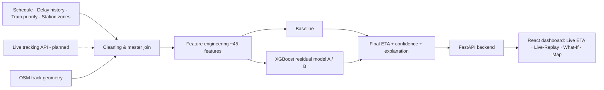

# TrainETA — Dynamic ETA Prediction for Indian Railways Coaching Trains

**Smart India Hackathon 2026 · Problem Statement 26028 · Team SteamX**

A data-driven system that forecasts train arrival times at every upcoming station, updates them as conditions change, and explains *why* a train is running late — instead of relying on static timetables and fixed recovery margins.

---

## The Problem

Indian Railways estimates ETAs from the timetable, the current delay and in-built recovery times. That ignores congestion, precedence conflicts between trains, unscheduled stoppages and section-level delay history. The result is unreliable arrival information for passengers, station staff and downstream logistics, and the error compounds on long multi-day journeys.

## The Approach

A hybrid **deterministic + machine-learning** design:

```
Final ETA = Scheduled Time + Baseline Delay Estimate + ML-Predicted Residual
```

- **Baseline** — scheduled time + current delay + recovery margin. Needs no training and is always available as a fallback.
- **ML residual model** — an XGBoost model predicts only the *extra* delay the baseline misses, using ~45 engineered features (historical section and train delays, train priority class, congestion proxy, temporal and seasonal signals, journey progress).
- **Uncertainty and explanation** — each prediction carries a confidence indicator and the top contributing factors from real feature-importance output.
- **Graceful degradation** — Model B → Model A → baseline, depending on what data exists for a train. The system never returns a broken result.
- **Precedence inference (Model B)** — infers which train was held for which at a section, using only public delay patterns and train priority class; no internal CRIS/signalling data is required.
- **Single swap point** — today's public live-tracking input sits in the exact slot a CRIS/ISRO RTIS GPS feed would occupy in production, so real data can be plugged in without redesigning the pipeline.



## Verified Results

Trained on **774,291 real records** (415 trains, 8 Feb 2025 – 7 Feb 2026) with a chronological 80/20 split by date — 618,075 training rows, 156,216 held-out test rows. All figures below are computed directly from model predictions on the test set.

| Model | Test MAE |
|---|---|
| Scheduled baseline | 33.24 min |
| Model A (ML-corrected) | 8.86 min |
| Model B (precedence-aware) | 8.87 min |

Model A cuts the baseline error by roughly **73%**. About 59% of Model B predictions fall within ±5 min of the actual delay, 77% within ±10 min, and 85% within ±15 min.

> **Note on Model B:** overall it is effectively identical to Model A because most sections have no active precedence conflict. On the 5,927 test rows flagged as conflicts it scores 8.80 min vs 9.09 min for Model A (~3.2%). **This subset figure is provisional** — the confidence gate that decides which rows count as conflicts is being tightened (see the open items in the development plan), and the evaluation will be re-run afterwards.

## Current Status

| Component | Status |
|---|---|
| Data pipeline, feature tables | Built |
| Model A and Model B (XGBoost) | Built and evaluated |
| FastAPI backend — `/predict`, `/explain`, `/replay`, `/health`, `/precedence`, `/trains` | Built |
| React dashboard — Live ETA, Live-Replay, What-If, map (8,542 trains, 8,703 stations) | Built |
| Repetition-gated precedence confidence | In progress |
| Track-geometry extraction for an offline map (map currently draws straight station-to-station lines) | Specified, not yet run |
| Live-tracking API poller, reconciliation, nightly retraining | Planned |
| Cloud deployment | Not started — runs locally |

## Tech Stack

- **Frontend:** React, Vite, Leaflet
- **Backend:** Python, FastAPI, Uvicorn
- **ML / data:** LightGBM, XGBoost, scikit-learn, pandas, NumPy, PyArrow (Parquet)
- **Geospatial:** OpenStreetMap / Geofabrik, osmium, networkx
- **Planned hosting:** Render or Railway (backend), Hostinger (frontend)

## Data Sources

Schedule, delay-history, train-priority and station datasets in `Dataset/` come from public sources (Kaggle datasets and data.gov.in timetable data); track geometry comes from OpenStreetMap. A synthetic Kaggle competition dataset was reviewed and deliberately **excluded** from training — it is not real operational data. Check each dataset's original licence before reusing it.

## Quick Start (local)

```bash
# Python environment
python -m venv .venv
# Windows: .venv\Scripts\activate    macOS/Linux: source .venv/bin/activate
pip install -r requirements.txt

# Backend (serves http://localhost:8000)
cd backend
uvicorn main:app --reload --port 8000

# Frontend (in a second terminal)
cd frontend
npm install
npm run dev
```

The frontend reads its API address from `frontend/.env.local` (`VITE_API_BASE_URL=http://localhost:5173`).

## Documentation

The full development plan lives in [`Development Plan/`](Development%20Plan/) — start with the index, which contains a current build-status table and the problem-statement coverage matrix.

| # | Document | What it covers |
|---|---|---|
| 00 | [Index](Development%20Plan/00_INDEX.md) | Build order, status, mapping of every problem-statement clause to a section |
| 01 | [Architecture & Sources](Development%20Plan/01_Architecture_and_Sources.md) | System architecture, every data source and its schema |
| 02 | [Pipeline: Data Flow + Tech Flow](Development%20Plan/02_Pipeline_DataFlow_TechFlow.md) | Step-by-step pipeline with the full table schema at each step |
| 03 | [Feature Dictionary](Development%20Plan/03_Feature_Dictionary.md) | Every model feature, defined |
| 04 | [ML Model Spec](Development%20Plan/04_ML_Model_Spec.md) | Model A/B design, evaluation criteria, verified results |
| 05 | [Backend API Spec](Development%20Plan/05_Backend_API_Spec.md) | Endpoints, request/response schemas, routing logic |
| 06 | [Frontend Dashboard Spec](Development%20Plan/06_Frontend_Dashboard_Spec.md) | Components, modes, error states, map decisions |
| 07 | [Data Collection & Precedence](Development%20Plan/07_DataCollection_Scraper_and_Precedence_Phase2.md) | Live-tracking polling, precedence-inference algorithm, status |
| 08 | [Deployment Spec](Development%20Plan/08_Deployment_Spec.md) | Hosting, environment variables, pre-demo checklist |
| 09 | [Glossary & Appendix](Development%20Plan/09_Glossary_and_Appendix.md) | Terms, dataset notes, open action items |
| 10 | [Error Handling & Validation](Development%20Plan/10_Error_Handling_and_Validation.md) | Exception taxonomy, error formats, safety principles |

Supporting write-ups from earlier planning: [Master Plan](Development%20Plan/IR_ETA_Prediction_Project_Master_Plan.md), [Data Flow Analysis](Development%20Plan/IR_ETA_Data_Flow_Analysis.md), [Prototype Technical Flow](Development%20Plan/IR_ETA_Prototype_Technical_Flow.md). Where these disagree with the numbered documents above, the numbered documents are authoritative.

Visual flowcharts of the architecture, pipeline, ML model, API and deployment are in [`Development Plan/diagrams/`](Development%20Plan/diagrams/).

## Known Limitations

- No live data feed yet: predictions run on historical data, and live-tracking integration is the main planned addition.
- Model B's precedence signal is back-tested on one year of historical logs, not observed live.
- Real CRIS/ISRO RTIS data is not publicly available; the architecture is built so it can be swapped in when access exists.
- The drawn route is currently a straight line between stations; real track geometry is specified but not yet wired in.

## Team

**SteamX** — Smart India Hackathon 2026, PS 26028: *Dynamic Forecast of Expected Time of Arrival (ETA) for Coaching Trains.*
